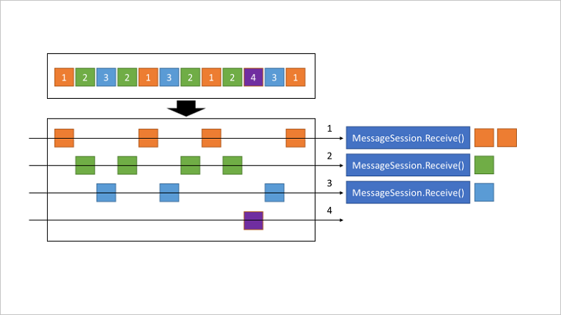

# Azure Service Bus - FIFO Queue

This sample demonstrates how to use Azure Service Bus FIFO Queues with the Azure SDK for Java.

## Message sessions [Standard/Premium Tier]

Azure Service Bus sessions enable joint and ordered handling of unbounded sequences of related messages. Sessions can be used in first in, first out (FIFO) and request-response patterns. 

Service Bus isn't prescriptive about the nature of the relationship between messages, and also doesn't define a particular model for determining where a message sequence starts or ends.

Any sender can create a session when submitting messages into a topic or queue by setting the session ID property to some application-defined identifier that's unique to the session. At the AMQP 1.0 protocol level, this value maps to the group-id property.



On session-aware queues or subscriptions, sessions come into existence when there's at least one message with the session ID. Once a session exists, there's no defined time or API for when the session expires or disappears. Theoretically, a message can be received for a session today, the next message in a year's time, and if the session ID matches, the session is the same from the Service Bus perspective.

Typically, however, an application has a clear notion of where a set of related messages starts and ends. Service Bus doesn't set any specific rules. For example, your application could set the Label property for the first message to start, for intermediate messages to content, and for the last message to end. The relative position of the content messages can be computed as the current message SequenceNumber delta from the start message SequenceNumber.

A session receiver is created by a client accepting a session. When the session is accepted and held by a client, the client holds an exclusive lock on all messages with that session's session ID in the queue or subscription. It will also hold exclusive locks on all messages with the session ID that will arrive later.

The lock is released when you call close methods on the receiver or when the lock expires. There are methods on the receiver to renew the locks as well. Instead, you can use the automatic lock renewal feature where you can specify the time duration for which you want to keep getting the lock renewed. The session lock should be treated like an exclusive lock on a file, meaning that the application should close the session as soon as it no longer needs it and/or doesn't expect any further messages.

When multiple concurrent receivers pull from the queue, the messages belonging to a particular session are dispatched to the specific receiver that currently holds the lock for that session. With that operation, an interleaved message stream in one queue or subscription is cleanly de-multiplexed to different receivers and those receivers can also live on different client machines, since the lock management happens service-side, inside Service Bus.

Only one receiver can have a lock on a session. A receiver may have many in-flight messages, but the messages will be received in order. Abandoning a message causes the same message to be served again with the next receive operation.

## Sequencing vs. sessions

Sequence number on its own guarantees the queuing order and the extraction order of messages, but not the processing order, which requires sessions.

If messages just need to be retrieved in order, you don't need to use sessions. If messages need to be processed in order, use sessions.

The same session ID should be set on messages that belong together, which could be message 1, 4, and 8 in a set, and 2, 3, and 6 in another set.


## Duplicate detection [Standard/Premium Tier]

If an application fails due to a fatal error immediately after it sends a message, and the restarted application instance erroneously believes that the prior message delivery didn't occur, a subsequent send causes the same message to appear in the system twice.

It's also possible for an error at the client or network level to occur a moment earlier, and for a sent message to be committed into the queue, with the acknowledgment not successfully returned to the client. This scenario leaves the client in doubt about the outcome of the send operation.


Enabling duplicate detection helps keep track of the application-controlled MessageId of all messages sent into a queue or topic during a specified time window. If any new message is sent with MessageId that was logged during the time window, the message is reported as accepted (the send operation succeeds), but the newly sent message is instantly ignored and dropped. No other parts of the message other than the MessageId are considered.

Application control of the identifier is essential, because only that allows the application to tie the MessageId to a business process context from which it can be predictably reconstructed when a failure occurs.

The MessageId can always be some GUID, but anchoring the identifier to the business process yields predictable repeatability, which is desired for using the duplicate detection feature effectively.

- When partitioning is enabled, MessageId+PartitionKey is used to determine uniqueness. When sessions are enabled, partition key and session ID must be the same.
- When partitioning is disabled (default), only MessageId is used to determine uniqueness.

## Duplicate detection window size

Apart from just enabling duplicate detection, you can also configure the size of the duplicate detection history time window during which message-ids are retained. This value defaults to 10 minutes for queues and topics, with a minimum value of 20 seconds to maximum value of 7 days.

Enabling duplicate detection and the size of the window directly impact the queue (and topic) throughput, since all recorded message IDs must be matched against the newly submitted message identifier.

For high throughput entities that require duplicate detection, you should keep the window as small as possible.

## Settling receive operations

When you receive a message from a queue or subscription, you can settle the receive operation in one of two ways:

### ReceiveAndDelete

The Receive-and-Delete mode tells the broker to consider all messages it sends to the receiving client as settled when sent. That means that the message is considered consumed as soon as the broker has put it onto the wire. If the message transfer fails, the message is lost.

The upside of this mode is that the receiver doesn't need to take further action on the message and is also not slowed by waiting for the outcome of the settlement. If the data contained in the individual messages have low value and/or are only meaningful for a very short time, this mode is a reasonable choice.

### PeekLock

The Peek-Lock mode tells the broker that the receiving client wants to settle received messages explicitly. The message is made available for the receiver to process, while held under an exclusive lock in the service so that other, competing receivers can't see it. The duration of the lock is initially defined at the queue or subscription level and can be extended by the client owning the lock, via the RenewLock operation. 

When a message is locked, other clients receiving from the same queue or subscription can take on locks and retrieve the next available messages not under active lock. When the lock on a message is explicitly released or when the lock expires, the message pops back up at or near the front of the retrieval order for redelivery.

The default value for the lock duration is 1 minute. 

## Running The Samples via IntelliJ

You need to create an Azure Service Bus namespace and a queue to run the samples. The samples expect the following environment variables to be set:

- `SERVICE_BUS_CONNECTION_STRING` - The connection string to your Service Bus namespace
- `SERVICE_BUS_QUEUE_NAME` - The name of your Service Bus queue

### Export Service

This service exposes an endpoint to send a message to service bus queue. A sample request can be:

```bash

POST http://localhost:8081/messages
Content-Type: application/json

{
    "message": "Hello World",
    "sessionId": "1234567890"
}
```

### Handler Service

This service receives messages from the service bus queue. Using a `SmartLifecycle` implementation, the service starts listening for messages when the application context is ready and stops listening when the application context is closed.
Implementing SmartLifecycle to start and stop the processor client was influenced by this discussion:

<https://github.com/Azure/azure-sdk-for-java/issues/29997>

### Load Testing

Using [k6](https://k6.io/), you can load test the service bus queue. The `k6` script is located in the `load-testing` directory. You can run the script using the following command:

```bash
./test.sh
```

## Running the samples via local k8s cluster

Create a new `.env` file and save it in the root directory of the project. The `.env` file should contain the following environment variables:

```bash
SERVICE_BUS_CONNECTION_STRING=<your-service-bus-connection-string>
SERVICE_BUS_QUEUE_NAME=<your-service-bus-queue-name>
```

Run the following command to create a generic secret in the cluster:

```bash
kubectl create secret generic service-bus-secrets --from-env-file=.env
```

Run the following command to deploy the services to your cluster using [Skaffold](https://skaffold.dev/):

```bash
skaffold run
```
